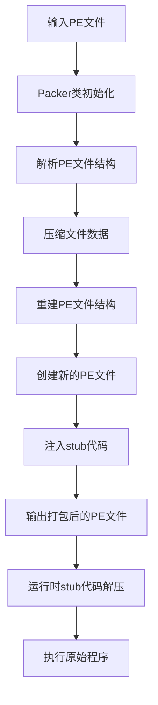

# stub-pack 项目代码维基

## 1. 项目概述

**stub-pack** 是一个 PE (Portable Executable) 文件打包工具，主要用于压缩和保护 Windows 可执行文件。该工具通过压缩原始可执行文件并添加自解压代码，实现减小文件体积和一定程度的保护功能。

### 主要功能
- PE文件解析与重建
- 数据压缩（使用 Windows 内置的 XPress Huffman 算法）
- 自解压 stub 代码注入
- 运行时自动解压与执行原始程序

## 2. 项目结构

```
├── Packer.cpp        # 主程序入口，处理命令行参数
├── Packer.h          # 核心打包逻辑实现
├── StubCode.Asm      # 汇编实现的自解压代码
└── README.md         # 项目说明文件
```

## 3. 系统架构与工作流程

### 整体架构



### 详细工作流程

1. **输入处理**：通过命令行参数接收输入和输出文件路径
2. **PE文件解析**：读取并解析PE文件的各个头部信息
3. **数据压缩**：使用 Windows 压缩 API 压缩原始文件数据
4. **PE结构重建**：创建新的PE文件结构，添加 `.pack` 节
5. **文件生成**：将压缩数据和stub代码写入新文件
6. **运行时解压**：当打包后的文件运行时，stub代码会：
   - 初始化环境并获取必要的系统函数
   - 解压原始文件数据
   - 修复导入表、重定位表和TLS表
   - 恢复原始程序的执行入口

## 4. 核心模块与类

### Packer 类

**主要职责**：负责PE文件的解析、压缩和重建。

**关键成员变量**：
- `m_inputFile`：输入文件路径
- `m_outputFile`：输出文件路径
- `m_file`：文件句柄
- `m_mapAddress`：内存映射地址
- `m_dosHeader`、`m_ntHeader`、`m_fileHeader`、`m_optionalHeader`：PE文件头部结构
- `m_compressor`：压缩器句柄
- `m_compressedBuffer`：压缩数据缓冲区

**核心方法**：

| 方法名 | 功能描述 | 参数 | 返回值 |
|-------|---------|------|--------|
| `pack()` | 执行完整的打包流程 | 无 | 0表示成功，-1表示失败 |
| `ParsePe()` | 解析PE文件结构 | 无 | 0表示成功，-1表示失败 |
| `CompressorData()` | 压缩文件数据 | 无 | 0表示成功，-1表示失败 |
| `RebuildPe()` | 重建PE文件结构 | 无 | 0表示成功，-1表示失败 |
| `CreateNewFile()` | 创建新的PE文件 | 无 | 0表示成功，-1表示失败 |
| `GetSectionAlignment()` | 计算节对齐大小 | size: 原始大小 | 对齐后的大小 |
| `GetFileAlignment()` | 计算文件对齐大小 | size: 原始大小 | 对齐后的大小 |

### Stub 代码模块

**主要职责**：在运行时解压原始程序并执行。

**关键函数**：

| 函数名 | 功能描述 |
|-------|---------|
| `StubEntry()` | stub代码的主入口点，协调整个解压过程 |
| `InitPackEnv()` | 初始化打包环境，获取必要的系统函数 |
| `FixImportTable()` | 修复导入表 |
| `FixRelTable()` | 修复重定位表 |
| `FixTlsTable()` | 修复TLS表 |
| `MyProcAddress()` | 自定义的GetProcAddress实现 |
| `MyStrcmp()` | 自定义的字符串比较函数 |
| `GetModuleBase()` | 获取模块基地址 |
| `GetKernel32Base()` | 获取Kernel32.dll基地址 |
| `MyCopyMemory()` | 自定义的内存复制函数 |

## 5. 核心 API/函数

### Packer::pack()

**功能**：执行完整的打包流程，包括解析PE文件、压缩数据、重建PE结构和创建新文件。

**调用流程**：
1. 调用 `ParsePe()` 解析PE文件
2. 调用 `CompressorData()` 压缩数据
3. 调用 `RebuildPe()` 重建PE结构
4. 调用 `CreateNewFile()` 创建新文件

### Packer::ParsePe()

**功能**：解析PE文件的各个头部结构，为后续操作做准备。

**实现细节**：
- 打开文件并创建内存映射
- 解析DOS头、NT头、文件头和可选头
- 定位节表

### Packer::CompressorData()

**功能**：使用Windows压缩API压缩原始文件数据。

**实现细节**：
- 创建压缩器（使用 COMPRESS_ALGORITHM_XPRESS_HUFF 算法）
- 计算压缩缓冲区大小
- 执行压缩操作
- 记录压缩时间和压缩率

### Packer::RebuildPe()

**功能**：重建PE文件结构，添加新的.pack节。

**实现细节**：
- 复制并修改DOS头和NT头
- 创建.old节和.pack节
- 更新入口点地址到stub代码

### Packer::CreateNewFile()

**功能**：创建新的PE文件，写入头部、压缩数据和stub代码。

**实现细节**：
- 创建输出文件
- 写入新的DOS头、NT头和节表
- 写入PackerInfo结构、压缩数据和stub代码
- 填充对齐所需的零字节

### StubEntry()

**功能**：stub代码的主入口点，协调整个解压过程。

**实现细节**：
- 初始化打包环境
- 获取模块基地址
- 定位PackerInfo结构
- 创建解压器
- 分配内存并解压数据
- 修复内存保护属性
- 复制解压后的数据到正确位置
- 修复导入表、重定位表和TLS表
- 恢复原始入口点并执行

## 6. 技术栈与依赖

| 技术/依赖 | 用途 | 来源 |
|----------|------|------|
| C++ | 主要开发语言 | 标准库 |
| x86汇编 | 实现stub代码 | MASM |
| Windows API | 文件操作、内存管理、压缩功能 | Windows SDK |
| imagehlp.h | PE文件结构定义 | Windows SDK |
| compressapi.h | 压缩API | Windows SDK |
| Cabinet.lib | 压缩功能库 | Windows SDK |

## 7. 运行与使用

### 命令行用法

```bash
packer <input.exe> <output.exe>
```

### 运行流程

1. **打包过程**：
   - 执行 `packer input.exe output.exe`
   - 程序会解析input.exe，压缩其数据，添加stub代码，生成output.exe

2. **运行过程**：
   - 运行output.exe
   - stub代码会自动解压原始程序
   - 解压完成后，控制权转移到原始程序的入口点

### 注意事项

- 仅支持32位PE文件
- 需要Windows操作系统环境
- 打包后的文件大小通常会比原始文件小（取决于文件内容的可压缩性）

## 8. 关键技术点

### PE文件结构操作

项目深入操作了PE文件的各个结构，包括：
- DOS头 (IMAGE_DOS_HEADER)
- NT头 (IMAGE_NT_HEADERS)
- 文件头 (IMAGE_FILE_HEADER)
- 可选头 (IMAGE_OPTIONAL_HEADER)
- 节表 (IMAGE_SECTION_HEADER)

### 内存操作

- 使用内存映射文件提高IO性能
- 运行时动态分配内存用于解压
- 修改内存保护属性以支持代码执行

### 压缩技术

- 使用Windows内置的XPress Huffman压缩算法
- 计算压缩率和压缩时间

### 自解压实现

- 使用汇编代码实现stub，减小体积
- 动态获取系统函数，避免静态依赖
- 修复各种表结构以确保程序正常运行

## 9. 代码优化建议

1. **错误处理改进**：
   - 当前代码中的错误处理较为简单，仅返回错误代码
   - 建议增加更详细的错误信息，便于调试

2. **安全性增强**：
   - 添加输入文件验证，确保只处理有效的PE文件
   - 增加异常处理，提高程序稳定性

3. **性能优化**：
   - 对于大文件，可以考虑使用多线程压缩
   - 优化内存分配策略，减少内存碎片

4. **功能扩展**：
   - 添加命令行选项，支持不同的压缩算法和级别
   - 增加对64位PE文件的支持
   - 添加加壳选项，提供更高级的保护功能

5. **代码结构改进**：
   - 将PE文件解析和操作封装为单独的类
   - 分离压缩逻辑，便于替换不同的压缩算法

## 10. 总结

stub-pack 是一个功能完整的PE文件打包工具，通过压缩和注入自解压代码，实现了文件体积减小和一定程度的保护功能。项目展示了PE文件结构的深入理解和操作，以及如何使用Windows API进行文件压缩和内存管理。

该工具的核心价值在于：
- 提供了一种简单有效的PE文件压缩方法
- 展示了PE文件结构的详细操作技术
- 实现了一个完整的自解压stub代码
- 为理解Windows可执行文件的运行机制提供了参考

通过进一步的优化和扩展，该工具可以成为一个功能更加强大的PE文件处理工具。